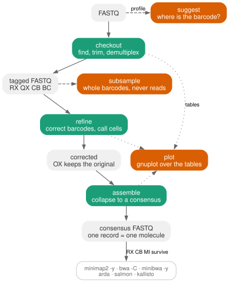
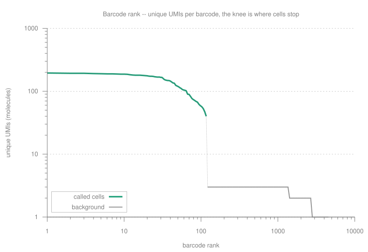
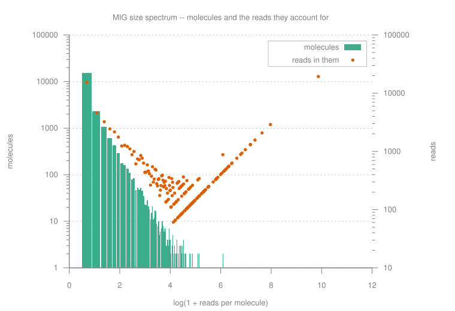
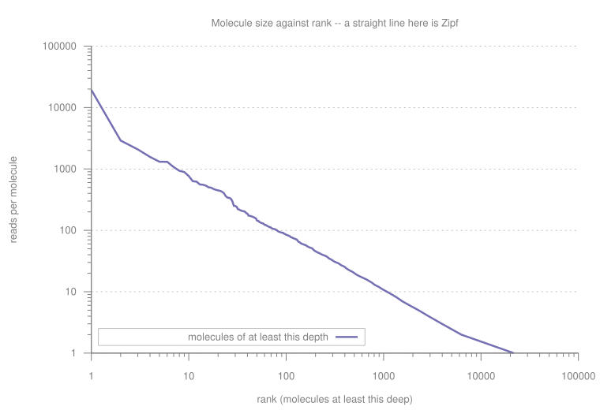
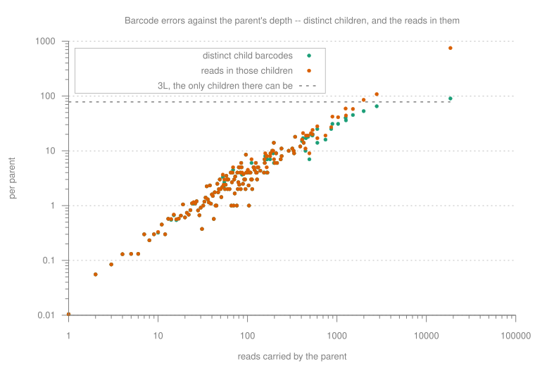
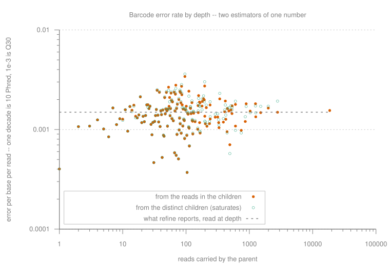
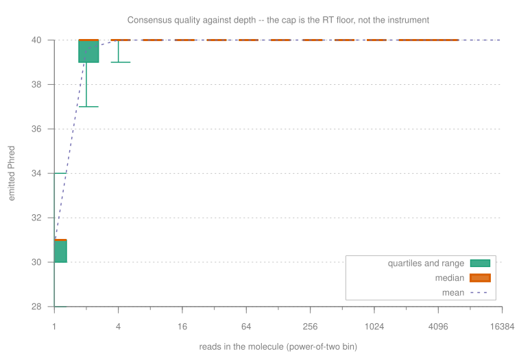
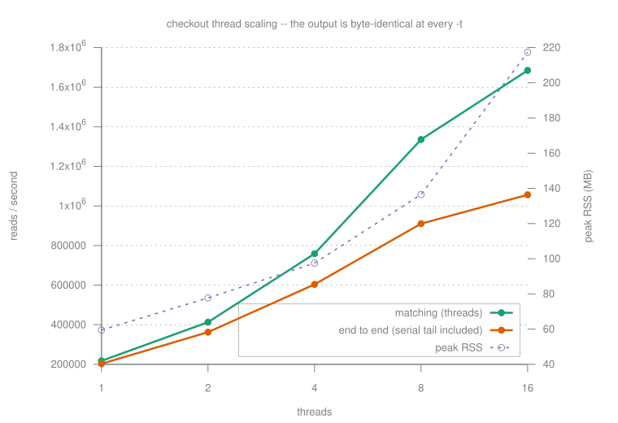

# migec

<p align="center">
  <a href="https://pypi.org/project/migec/"></a>
  <a href="https://github.com/antigenomics/migec/actions/workflows/ci.yml"></a>
  <a href="https://antigenomics.github.io/migec/"></a>
  
  
  
</p>

**UMI barcode extraction, correction and consensus assembly for barcoded sequencing data.**

A complete C++20 rewrite of [MIGEC](https://doi.org/10.1038/nmeth.2960) (Shugay et al., *Nature
Methods* 2014) and [MAGERI](https://doi.org/10.1371/journal.pcbi.1005480) (Shugay et al., *PLoS
Computational Biology* 2017).

> **Version 2 is under construction.** All three stages work today — `checkout`, `refine` and
> `assemble` — with cell barcodes, whitelists, dual-end and positional (10x) layouts, cell calling,
> QC figures, and `suggest`/`subsample`/`plot`. Index hopping, `.mig` bucket output and the published benchmark
> comparisons are what remain; see [`ROADMAP.md`](ROADMAP.md). The Groovy MIGEC 1.2.9 is archived on
> branch [`legacy-v1`](../../tree/legacy-v1) and at tag `v1-final` — Java users want the jars on the
> [1.2.9 release](../../releases/tag/1.2.9).

## Why

Tag each molecule with a random barcode before amplification and every read carrying that barcode
descends from one original molecule. Collapsing them into a consensus removes essentially all
sequencing error — which is what makes rare-variant detection and error-free repertoire profiling
possible. The difficulty is entirely in the details:

- **Barcodes acquire errors too.** Distinguishing an error-child barcode from a genuine collision
  needs the birthday bound, the base qualities, *and* the fact that a polymerase error in an early
  PCR cycle carries high quality in every read that inherits it. Treating that as a sequencing
  error is the dominant residual mistake in UMI counting.
- **A molecule seen three times is still information.** Cutting at a coverage threshold throws away
  real sequence. migec keeps low-coverage molecules that have no plausible parent and reports the
  uncertainty rather than deleting the data.
- **Consensus cannot fix an error made before amplification.** An RT or first-cycle PCR error is in
  every read. Any quality above that floor is a fiction, so migec measures the floor from the data
  and refuses to claim more.

## Pipeline

<p align="center"></p>

Three stages, plus three tools that read no reads: `suggest` says where the barcode is,
`subsample` cuts a fixture that is still a library, and `plot` draws every QC panel with gnuplot
from the TSVs the stages already wrote. Regenerate the figure with
`dot -Tsvg assets/pipeline.dot -o assets/pipeline.svg`.

Output is ordinary FASTQ. One record is one molecule, and its identity is carried twice — in the
read **name** (`<sample>.<cell>.<umi>`, for tools that drop FASTQ comments) and in tab-separated
**SAM tags** (for tools that keep them), so this works and was measured
([docs/downstream.rst](docs/downstream.rst)):

```bash
minimap2 -ax sr -y ref.fa cons/S1.consensus.fq.gz | samtools sort -o S1.bam   # RX, CB, MI in the BAM
minibwa map -y -t8 ref.fa cons/S1.consensus.fq.gz | samtools sort -o S1.bam   # `-y`, not bwa's `-C`
bwa mem -C     ref.fa cons/S1.consensus.fq.gz     | samtools sort -o S1.bam
arda amplicon --r1 cons/S1.consensus.fq.gz -p S1      # AIRR sequence_id IS the molecule id
salmon quant -i tx.idx -l A -r cons/S1.consensus.fq.gz -o quant/   # NumReads are molecule counts
```

[minibwa](https://github.com/lh3/minibwa) spells the comment flag `-y` on `map` and `-C` on the
legacy `mem` subcommand — the wrong one exits with an error rather than dropping the tags quietly.
Whether to align *before* grouping (position + UMI, the fgbio/UMIErrorCorrect order) or after
collapsing is a real choice, and [docs/downstream.rst](docs/downstream.rst) works through what each
one buys.

> **Never** run alevin, bustools or STARsolo on a consensus FASTQ. They read the barcode out of a
> *raw* barcode read and deduplicate themselves; migec already did, and that read no longer exists.

## Install

```bash
pip install migec
```

Wheels for CPython 3.10–3.13 on Linux x86-64 and macOS arm64. From source: `bash setup.sh`.

## Usage

There is exactly one thing migec has to be told: **where the barcode is**. Most libraries put it at
a fixed offset in one read, so that is the primary way to say it — a position, no sheet, no anchor:

```bash
migec checkout reads.fq.gz --bc-pattern '^NNNNNNNN'  -o out/    # 8 nt UMI at the read start
migec checkout reads.fq.gz --bc-pattern '0:8'        -o out/    # the same, as a half-open slice
migec checkout reads.fq.gz --bc-pattern '0:4,5:10'   -o out/    # 9 nt UMI split by one spacer base
migec checkout R1.fq.gz R2.fq.gz --bc-pattern 'cell:0:16,16:26' -o out/     # 10x
migec checkout R1.fq.gz R2.fq.gz --bc-pattern '^XXXXXXXXXXXXXXXXNNNNNNNNNN' -o out/   # the same
```

`N` is a UMI base, `X` a cell-barcode base, and slices are half-open and 0-based like Python's, so
`0:8` is eight bases and the next slice may start at 8. A leading `^` — and every slice list, since
a position is only a position if it is measured from somewhere — **anchors the barcode at the first
base**, which is what `--max-offset 0` used to have to say by hand. Getting that wrong is not a
tuning mistake: a layout with no constant sequence gives a free scan no evidence to choose an
offset with, and migec refuses rather than picking one.

Or name the chemistry (`migec sheet --presets` prints all of them, and where each layout is
written down):

| preset | layout | |
|---|---|---|
| `umi` | `^NNNNNNNN` | generic inline UMI |
| `migec` | `cagtggtatcaacgcagagtNNNNtNNNNtNNNN` | MIGEC 5'-RACE RepSeq |
| `primerid` | `NNNNNNNNNcagtttaacttttgggccatcca` | HIV-1 Primer ID, as used by MAGERI |
| `duplex` | `^NNNNNNNNNNNN.....` on both mates | duplex sequencing |
| `10x` | `^XXXXXXXXXXXXXXXXNNNNNNNNNNNN` | 10x Chromium 3' v3 |
| `10x-v2` | `^XXXXXXXXXXXXXXXXNNNNNNNNNN` | 10x Chromium 3' v2 and 5' |
| `tso500` | `^NNNNN.....` on R1 | Illumina TSO500 ctDNA — read the warning in [docs/layouts.rst](docs/layouts.rst) |
| `smarter-umi` | `^NNNNNNNNNN...` | SMARTer template-switching RNA-seq |

```bash
migec checkout R1.fq.gz R2.fq.gz --preset 10x-v2 -o out/
```

fgbio, Picard, samtools and TSO500 write the same thing as a *read structure*, taken verbatim:

```bash
migec checkout R1.fq.gz R2.fq.gz --read-structure 5M5S+T -o out/    # TSO500: `5M5S+T +T`
```

### Many samples in one file

Then it is a barcode table — MIGEC's, read verbatim. Uppercase is matched exactly (IUPAC degeneracy
allowed), lowercase is the fuzzy adapter region, and UMI runs need not be contiguous:

```
S1	aaACTcagtggtatcaacgcagagtNNNNtNNNNtNNNN
S2	aaAGAcagtggtatcaacgcagagtNNNNtNNNNtNNNN
```

Column 3 is MIGEC's *slave* pattern — a second pattern on the other mate whose captured positions
**extend** the UMI, which is how a 24 nt dual-end barcode is declared:

```
S1	NNNNNNNNNNNNtgact	agtcaNNNNNNNNNNNN
```

```bash
migec suggest reads.fq.gz                            # where is the barcode? read it off the data
migec sheet barcodes.txt                             # what will each row extract?
migec checkout reads.fq.gz -b barcodes.txt -o out/
migec checkout R1.fq.gz R2.fq.gz -b barcodes.txt -o out/ -t 8
migec refine out/S1.fq.gz -o ref/                    # correct barcode errors
migec assemble ref/S1.fq.gz -o cons/                 # one consensus per molecule
migec subsample out/S1.fq.gz -o small.fq.gz --keep 1 # a fixture that is still a library
migec plot out/                                      # QC figures from the tables just written
```

Every stage takes `-t/--threads` (one per core by default) and `--limit-read N` / `--limit-umi N`,
which stop the intake after N reads or N distinct barcodes. Limits are for getting an answer out of
a 400 GB run in a minute. Never a sample: the first N reads of a FASTQ are one corner of one
flowcell, so a limited run reports that it was limited and nothing measured under one transfers to
the library. `subsample` is the sampler.

```
reads       2,000,000
  assigned  2,000,000 (100.0%)
  unmatched 0 (0.0%)
  ambiguous 0 (0.0%)

1.6 s (1,243,801 reads/s) = 1.5 s matching on 8 threads + 0.1 s UMI statistics
peak RSS 136.0 MB of which UMI counters 11.5 MB

sample             reads        UMIs  reads/UMI  UMI len  eff len
S1               500,000     125,000       4.00       12    12.00
S2               500,000     125,000       4.00       12    12.00
```

Paired input searches both mates for the tag and swaps the pair so R1 always carries it — an
amplicon library sequenced in both orientations otherwise loses half of each MIG at consensus, and
nothing upstream reports it.

Reads come out trimmed of adapter, sample tag and UMI, with the barcode carried in SAM-style tags
that survive `bwa mem -C` and `minimap2 -y` into the BAM:

```
@r0 RX:Z:GCTAAAGACAAT	QX:Z:IIIIIIIIIIII	BC:Z:S1
TACATAACATACACGTCAGCACGAAACTTGTTGGCCCAGTGTGAATCGCTT
```

alongside `checkout.summary.tsv`, `checkout.coverage.tsv` (the MIG size histogram) and
`checkout.umi_composition.tsv` (per-position base usage, entropy, information content).

Note: `umi_tools` spells a cell barcode `C`, which is **cytosine** here; pasting one is refused with
the translation rather than compiled into a pattern that matches nothing. And on a barcode-only
read — 10x R1 is 26 nt of barcode and nothing else — `refine` and `assemble` take **R2**.

On `sc5p_v2_hs_PBMC_1k` VDJ-T: **100% of 3,155,166 reads assigned**, 221,024 barcodes at 14.28
reads each, 813 cells called.

### It corrects the barcodes, with the evidence that survives at one read

```bash
migec refine out/S1.fq.gz -o ref/
```

A barcode one substitution from another is either an error child of it or an independent molecule.
The count ratio separates them on a deep amplicon and is worth **nothing** at 1–3 reads per UMI, so
`refine` also uses the barcode's own base quality at the position that differs — `checkout` already
writes it to `QX` — and **payload agreement**, since an error child is a read of the parent's
molecule. Agreement is worth `log(1/clonality)`, and the clonality is measured rather than assumed:

```
barcodes    23,910 distinct
  merged    3,855 (16.1%) into a parent, 3,889 reads moved
molecules   20,055 after correction          <- 20,000 were simulated

barcode error   2.87e-03 per base            <- 3.0e-03 injected
clonality       0.0100 of random barcode pairs carry the same payload anyway
                -- payload agreement is worth about 100x odds towards the same molecule here
```

Note: At ~1 read per UMI **80% of barcode errors cannot be fixed by anyone** — the parent barcode was
never sequenced. migec corrects a tenth of the rest and destroys no real molecule at any depth
measured, which is the side to err on: a wrong merge deletes a molecule and nothing downstream can
tell, while a missed correction only inflates a count. Every corrected read keeps what it was in an
`OX:Z:` tag. See [docs/refine.rst](docs/refine.rst).

### It collapses each molecule, and caps what it claims

```bash
migec assemble out/S1.fq.gz -o cons/
migec assemble out/S1.fq.gz -o cons/ --contig     # random-primed reads that tile the molecule
```

A molecule is **sample + cell barcode + UMI**, never the UMI alone — the same UMI in two cells is
two molecules, and that is the design rather than a defect. Reads are range partitioned on the
packed key into `.mig` buckets and one bucket is sorted at a time, so nothing scales with the
library: 2,423,777 reads/s, and 123 MB at 16 buckets against 203 MB at one.

The per-column posterior is `LL[j][b] = Σ_i (r==b ? log(1−e) : log(e/3))`, and then the number that
matters:

```
Q(j) = −10 log10( p_cons(j) + p_floor )
```

The floor is **added, not compared**, and it is named rather than guessed — an RT or
first-cycle-PCR error is in every read of the molecule and no consensus removes it:

```bash
migec assemble ... --rt-error rt        # 1e-4, caps at Q40. Anything with an RT step (default)
migec assemble ... --rt-error medium    # 1e-5, caps at Q50. No RT, an ordinary polymerase
migec assemble ... --rt-error high      # 1e-6, caps at Q60. No RT, a proofreading polymerase
migec assemble ... --rt-error 7.37e-5   # or the rate itself, e.g. TruSight Oncology 500 v2
```

This is the **one-molecule** floor and every record here is one molecule. 10x state it exactly:
*"The estimated error rate for the V(D)J RT reaction is 1e-4 per base. Therefore, assembled bases
that are covered by a single UMI are assigned Q40, and bases covered by at least two UMIs are
assigned Q60."* The Q60 branch needs two molecules to agree — an RT error is common-mode within a
molecule and independent between them — and combining molecules is
[arda](https://github.com/antigenomics/arda)'s job. `1e-4` is also what X2 measured here
independently (1.54e-4 on SRR1763769), and the polymerase classes come from
[McInerney *et al.* 2014](https://doi.org/10.1155/2014/287430) (Taq 4.3e-5, Pfu 2.8e-6, Phusion
2.6e-6, Pwo 2.4e-6 per bp per duplication) — with the first cycle worth ~5x an ordinary one
([Shagin *et al.* 2017](https://doi.org/10.1038/s41598-017-02727-8)).

Which is exactly what comes out: one read carries the payload's own error and the curve flattens
at the floor rather than at the instrument — drawn as a box per depth bin, [further down](#it-draws-its-own-qc).

Very deep barcodes are capped at **10,000 reads into the consensus** — past that the column
posterior has long since saturated while the group still costs time and memory, which is 10x's
rule and their reasoning. The cap applies to the reads that are *consensed*, never to the reads
that are *counted*: `cD` stays the true depth of the molecule.

`--contig` is for random-primed libraries, where reads sharing a barcode tile the molecule instead
of starting at the same base. They are placed against each other by seed matching, cut into overlap
components, and one consensus is emitted per component — a component is **never** extended across a
gap, because 27.3% of 10x groups hold more than one and a single consensus over those asserts
sequence no read covers. Assembling a cell's full receptor and calling doublets is
[arda](https://github.com/antigenomics/arda)'s job, not this one.

Note: Contig assembly needs a barcode that is not saturated: two fragments of two *different* molecules
sharing a barcode have no sequence in common, which is exactly what two fragments of one look like.
`assemble` runs the same birthday arithmetic on the barcodes it saw and reports how many molecules
a group holds on average — above 1, the warning says so. See [docs/assemble.rst](docs/assemble.rst).

### When the deliverable is a count, not a sequence

```bash
migec assemble ref/S1.fq.gz -o cons/ --fast
```

Counting mode: the group's most frequent **exact** sequence, with every base carrying the best
quality any read of *that* sequence reported. No column model, so no per-base error correction and
no sub-clustering — and the RT floor still caps what it claims. Use it for expression and
clonotype abundance, where a molecule count is the answer and the sequence only has to be right
often enough to assign. Measured against the full path on 8-read molecules at 5e-3 per base: the
column posterior removes essentially every sequencing error, and the majority string keeps
whatever it carried. `--fast` is refused with `--contig`, whose tiling reads share no exact
sequence to take a majority over.

### It draws its own QC

```bash
migec plot out/                       # every panel whose table is in out/
migec plot cons/ -o figs/ --format pdf
```

Twenty panels. Every one is a gnuplot script over a TSV a stage already wrote, so a figure can be
redrawn from the table next to it long after the FASTQ is gone, and a figure can never disagree
with the number in the report. gnuplot is not a Python dependency: without it the `.gp` scripts are
still written. Every SVG is **transparent and mid-grey**, so one file serves a light README, a dark
README and a printed page — and the legend sits inside the plot box, not in a gutter that makes
every figure wider than its data. See [docs/plots.rst](docs/plots.rst).

Four of them are the ones you already know how to read.

**The barcode rank plot**, on Cell Ranger's axes, because that is the figure every user of a
droplet protocol has seen. Barcodes sorted by how many **distinct UMIs** they carry — never by
reads, since one over-amplified molecule would otherwise put an empty droplet high on the curve,
which is the artefact the plot exists to show. The call is drawn *on* the curve.

<p align="center"></p>

**The MIG size spectrum**, molecules and the reads they account for, on `log(1 + size)`. Both
series, on their own axes, because they peak in different places the moment a library is
over-sequenced: most *molecules* are shallow, most *reads* are in the deep ones. A figure with only
the first says the library is fine; a figure with only the second says it is saturated. `log1p`, so
a molecule seen once still has a place on the axis.

<p align="center"></p>

**The rank/Zipf curve** — molecule size against rank, log-log. A straight line is Zipf, and
amplification bias bends it. This is why `refine` writes the size spectrum at *exact* sizes rather
than in power-of-two bins: four bins make four steps, and a straight line cannot be told from a
bent one.

<p align="center"></p>

**Barcode errors against the parent's depth** — how many distinct error children a molecule
spawned, and how many reads were in them. A parent seen *c* times had *c·L* barcode bases to
miscall, so both series climb with *c* — but only one of them can climb forever. There are exactly
*3L* barcodes one substitution away, so the distinct-children series bends over at the dashed line
while the reads series carries straight past it. Where they part is where this library's barcode
neighbourhood filled up, measured rather than predicted.

<p align="center"></p>

Invert both and you get two estimates of the same barcode error rate, per depth, with what `refine`
reports drawn across them. The y axis is a log error rate, so one decade is exactly ten Phred and
1e-3 is Q30 — which makes the number directly comparable with the barcode's own reported quality,
the only independent check on it there is. On a diverse library sequenced 25 deep it lands within
1% of a known injected rate.

<p align="center"></p>

> **Never** read this instead of the `saturated` flag. Both series count only the children
> correction actually merged, and on a *full* barcode space `refine` refuses to merge — rightly,
> because a distance-1 neighbour there is more likely a real molecule than an error child — so both
> estimates collapse to zero. Against a known rate they are 0.99 and 0.97 of the truth at 0.2%
> occupancy, 0.62 and 0.45 at 33%, and nothing at 100%. See
> [docs/umi_errors.rst](docs/umi_errors.rst).

**Consensus quality against depth**, as a box, never a thinned scatter. Emitted quality is discrete
and capped at the floor, so at any real depth every molecule sits on one or two integers: a cloud
of dots draws that as a flat line whether the bin holds ten molecules or ten million, and thinning
it throws away the tails that were the only thing the cloud could have shown. These are exact order
statistics over every molecule, read off a (depth, quality) count grid.

<p align="center"></p>

`checkout.summary.tsv` carries unique UMIs and reads per **sample** barcode, drawn the same way by
the `sample_umis` panel — the multiplexed analogue of the same question.

### It finds what the trim left behind

`migec suggest` profiles *any* FASTQ, so point it at the output of a stage rather than its input:

```bash
migec suggest out/S1.fq.gz -o qc/       # did the trim actually remove the primer?
```

An 8-mer occurs by chance about every 65 kb, so synthetic sequence that survived shows up as a run
of k-mers each shifted one base from the last, hundreds of times more often than the reads' own
base composition predicts — and the run is stitched back into the sequence it came from:

```
kmer           count   obs/exp    reads  mean pos
GGGCCATC      20,023     701.2  100.0%      22.1
TGGGCCAT      20,018     656.4  100.0%      21.0
TTGGGCCA      20,018     656.4  100.0%      20.0

overlapping into: CAGTTTAACTTTTGGGCCATCCA
```

Overrepresentation is against the reads' **own** base composition, never a flat 1/4: a 70% AT
library makes every AT-rich k-mer look enriched against uniform, and the table would then be a
description of the GC content rather than a finding.

### It tells you where the barcode is

`migec suggest` reads the layout off the reads rather than off the protocol. A UMI cycle is one the
synthesiser mixed — all four bases near 1/4, ~2 bits. A constant cycle is one base near 100%.
Everything else is payload.

```
 cycle      A      C      G      T  1/4 dev     Q  layout
     0  0.271  0.205  0.257  0.267    0.045    33  N  UMI
     ...
     9  0.020  0.971  0.004  0.006    0.721    37  |  constant

segments:
    0-8   umi         9 nt  (mean 1/4 deviation 0.038)
    9-31  constant   23 nt  (mean 1/4 deviation 0.718)  CAGTTTAACTTTTGGGCCATCCA

pattern  NNNNNNNNNcagtttaacttttgggccatcca
```

That is a real HIV Primer ID library (SRR1763769) with nothing supplied but the FASTQ. The pattern
pastes straight into a barcode table, and checking it out assigns 95.0% of reads.

### It tells you whether the barcode was big enough

A 12 nt UMI is 4¹² = 16,777,216 sequences — if the synthesiser delivered exactly 25% of each base.
It never does, so the usable space is the **collision** (Rényi-2) entropy, `1 / Π_j Σ_a p_j(a)²`,
never Shannon: `H₂ ≤ H₁`, so Shannon overstates the space and understates collisions, which is the
direction that silently merges molecules.

From there the birthday problem, in the form that survives a full space:

```
occupied = S·(1 − e^−λ)     molecules = S·λ     P(k>1 | k≥1) = (1 − e^−λ − λe^−λ)/(1 − e^−λ)
```

```
sample              space  occupancy  MIGs >1 mol   molecules   err pred   err est
CTRL              250,902      49.9%        30.6%     173,482    2.0e-03   2.7e-04

warning: CTRL: 31% of MIGs hold more than one molecule (50% of a 250,902 barcode space is
  occupied). Their consensus is a mixture of templates, not a molecule
warning: CTRL: the barcode error estimate (2.7e-04) is not reliable here -- 50% of each barcode's
  1-substitution neighbourhood is itself occupied ...
```

`scripts/collision_check.py` checks that prediction against something model-free — two molecules
sharing a barcode with *different sequences* are visible in the reads — and finds 1.86× more
collisions than predicted. That is *not* the position-independence assumption in `Π_j m_j`, which a
permutation puts at 1.01× — it is the read threshold, since a collided barcode carries two
molecules' reads and is over-represented among the MIGs big enough to show a split.

The barcode error rate is estimated from the distance-1 excess and reported next to what the
reported Phred and the polymerase predict. Note: The estimator has a working range: it recovers 0.92×
of an injected rate at 0.3% occupancy and 0.23× at 50%, always collapsing *downward*, so it is
flagged unreliable past 5% neighbourhood occupancy rather than quietly believed.

Full derivations in [docs/barcode_space.rst](docs/barcode_space.rst); `notebooks/barcode_space.py`
draws it.

### Every derivation has a permutation that checks it

`scripts/permutation_nulls.py` measures three quantities the pipeline otherwise derives, assuming
nothing. On the same HIV library — 125,369 distinct 9 nt barcodes, 47.8% occupancy:

| derived from a model | measured by permutation | |
|---|---|---|
| positions are independent | 1.01× excess, purely nearest-neighbour | holds, to ~1% |
| distance-1 pairs are error children | 97% are chance; ~18,000 are real | permute the background |
| split a MIG at nominal `p < 0.01` | 1% false positives at `-log10 p` = 8.68 | **19× over-call** |

The independence null is a *distribution* — the product measure `q(u) = Π_j p_j(u_j)` — so it is
tested with Jensen-Shannon divergence against a same-size draw from `q`, not with one functional of
each. The residual dependence is entirely between **adjacent** positions, and it has a cause: 0.55%
of reads carry a barcode one base short, a coupling step that did not fire, which frameshifts
everything after it.

The last one is the one that mattered. Reads are not exchangeable — a low-quality read carries a
minor base at many positions at once and looks exactly like a linked subclone — so the null has to
preserve *both* margins of the reads × positions matrix, per-position error count and per-read
error load. The nominal threshold calls 30.62% of MIGs as two molecules; the permutation calls
1.60%. The threshold is a Monte Carlo estimate and its error is quoted: **8.68, bootstrap 95% CI
[8.42, 9.14]** over 82,800 randomisations — a tail quantile from a tenth as many gave 9.61 and
11.66, so the interval is the number, not the point. See [docs/nulls.rst](docs/nulls.rst).

### Most UMIs have 1–3 reads, and that is the normal case

Bulk repertoire profiling and shallow 3' single-cell both put the MIG size histogram's mass at 1–3
reads. migec runs there and says what it can support rather than quoting a number calibrated on a
deep library: the split threshold is inert (a pair of columns can carry at most `log10 C(n, n/2)`,
so it needs ~30 reads), the count-ratio error-child null has no dynamic range, and **nothing is
thresholded away** — `--min-reads` defaults to 1, because a molecule seen once is still a molecule
and the answer to a barcode error is to correct it, not to delete it.

```
    MIG size      groups    share
           1      31,888    79.4%
         2-3       8,176    20.4%
         4-7         112     0.3%

warning: 79.4% of molecules were seen once. A consensus over one read is that read --
  the UMI is buying counting here, not error correction
```

It is also the memory-hostile case, because distinct barcodes are what everything scales with, so
it is what the benchmarks use: 1,179,549 reads/s at 1.02 reads/UMI, 282 B resident per distinct
barcode, still bounded by the bucket rather than the library.

### Speed and memory are reported, not assumed

`--threads` defaults to one per core on **all three stages**, and **the output is byte-identical
whatever it is set to** — checkout matches in chunks and writes them back in input order, refine
scans the barcode neighbourhood in parallel and applies the merges it finds serially, and assemble
gives each worker its own bucket and concatenates them in bucket order. `-t` changes the wall clock
and nothing else, which is asserted per stage in C++, at the CLI, and under the thread sanitizer.

| stage | 1 thread | 16 threads | bound by |
|---|---|---|---|
| `checkout` | 213,880 | **1,548,835** | reads |
| `refine` | 617,802 | **1,554,156** | distinct barcodes |
| `assemble` | 554,106 | **2,470,928** | reads, then the largest bucket |

reads/s — `refine` and `assemble` on a 500 k-read sample, `checkout` on 2 M. Two of those used to
be 222,017 and 202,977, and the first fix was not a thread: **zlib at
its default level 6 was 83% of refine's wall clock**, compressing an intermediate the next stage
decompresses immediately. Level 1 costs 21% more bytes and gave 3x before a single thread was
added. Measure the stage before parallelising it.

The same lesson twice in assemble: after the consensus was threaded, the **partition** was 2.07 s
of a 2.69 s run against a 0.23 s `gzip -dc` floor for the same file — so it was not the inflate. It
runs on the workers now, by ownership rather than locking (worker *w* owns every bucket with
`bucket % threads == w`), and half the win was in the reader: the chunk is assigned into rather
than cleared, because `clear()` destroys four `std::string` per record and the reader ends up in
malloc instead of inflate.

| 4 M reads, `-t 16` | before | after |
|---|---|---|
| wall clock | 2.70 s | **1.95 s** |
| reads/s | 1,481,946 | **2,051,937** |
| peak RSS | 1,479 MB | **789 MB** |

That is the record of *that* change. Batching the work-claiming atomic later took the same corpus
to **1.72 s and 2,324,403 reads/s**.

The memory fell with it, because the estimate deciding how finely to cut the input said a gzipped
FASTQ goes resident at 8x its on-disk size and it is really **19x** — a resident record is two heap
`std::string` with their allocator headers, not the 180 bytes of payload. Guessing low picks too
few buckets, and pass 2 holds sixteen of them at once.

And once every stage was threaded, the largest single cost in the whole pipeline was the
**thread helper itself**. `parallel_for` handed out one item per atomic `fetch_add`, and when an
item is one read's tag scan that instruction took **21% of all CPU samples across every thread** —
more than the work it was handing out. Sixteen cores serialise on one cache line. Items are claimed
in batches now, sized so each worker takes ~8 turns, collapsing to 1 when there are few items,
which is the uneven case (one bucket per item) the counter existed for. Two serial blocks went with
it: the distance-1 census inside `estimate_umi_error`, which is checkout's per-sample tail, and
refine's residual-FDR scan, which was 0.53 s of a 2.17 s run on one core after everything around it
had been parallelised. Both are read-only scans of the barcode table that tally integers, so they
thread exactly and `-t` still changes nothing but the clock.

| threads | reads/s | matching reads/s | peak RSS |
|---|---|---|---|
| 1 | 213,880 | 216,584 | 59 MB |
| 2 | 394,471 | 403,393 | 79 MB |
| 4 | 737,777 | 768,810 | 101 MB |
| 8 | 1,256,838 | 1,349,533 | 139 MB |
| 16 | **1,548,835** | **1,697,313** | 215 MB |

<p align="center"></p>

2 M single-end 129 nt reads, four barcode patterns, 4 reads per molecule, M-series laptop.
`python scripts/benchmark_threads.py --reads 2000000 -o assets/` writes that table, and the figure
is drawn from it — the two cannot drift apart. Two
things had to be true for the matching to scale. zlib compresses random DNA at **7 MB/s** at its
default level 6, so compression runs on the workers (concatenated gzip members are a valid gzip
stream) at level 1 — 137 MB/s for 13% more bytes. And the log-likelihood score tabulates into
1.2 kB, because the `log2` in the inner loop was 90% of runtime.

Both columns are reported, because they scale with different things and only one of them threads:
matching scales with reads, the UMI statistics with *distinct* UMIs at ~1.5–2 µs each, on one
thread. That serial tail is why the end-to-end column flattens at 16 while matching is still
climbing.

The UMI counters are a sorted `(key, count)` array rather than a hash map: **~22 bytes per distinct
UMI against ~48**, which at the 4·10⁸ distinct UMIs of an ordinary NovaSeq run is 8.8 GB against
19 GB. That still does not fit a laptop — the counters are not yet partitioned, so checkout warns
when they pass 1 GB rather than letting you find out from the OOM killer. See
[`docs/performance.rst`](docs/performance.rst).

### Grouping accuracy is measured against Calib

`scripts/compare_calib.py` scores both tools' read partitions against a known truth with the
adjusted Rand index, and reports **splitting and merging separately** — splitting inflates the
molecule count and is recoverable, merging mixes molecules and destroys real variants.

| UMI | UMI error | ARI | reads split | reads merged |
|---|---|---|---|---|
| 12 nt | 0 | **1.0000** | 0.0000 | 0.0000 |
| 12 nt | 5·10⁻³ | 0.9348 | 0.5165 | 0.0004 |
| 6 nt | 0 | 0.8877 | 0.0000 | 0.3982 |

Calib clusters on barcode *and* sequence; migec today groups on the barcode alone, and the gap is
exactly the collision rate — which `eff len` predicts before any clustering runs. A clean 12 nt
barcode needs nothing cleverer; a 6 nt one cannot be rescued by any amount of barcode cleverness,
only by sequence, which is what `assemble` adds.

### `eff len` is the number to look at

A 12 nt UMI is not worth 12 nt unless its bases are uniform. `effective_length` is
$-\sum_j \log_4 \sum_a p_j(a)^2$ — what the barcode is actually worth. A 12 nt UMI with eight
fixed positions has an effective length of 4, a usable space of 256, and will collide constantly.

The distinction matters more than it looks: a sequence logo draws *Shannon* entropy, but the
probability two molecules collide is the *Rényi-2* (collision) entropy. Since H₂ ≤ H₁, using
Shannon overstates the usable space and understates collisions — the direction that silently merges
distinct molecules. Both are reported; only the collision form feeds any decision.

## Pipelines

`integrations/nextflow/` is an nf-core-style local module set — four processes, a subworkflow,
`meta.yml`, `nextflow.config`, `environment.yml` — that drops into
[nf-core/airrflow](https://nf-co.re/airrflow) or anything else that hands you FASTQ pairs. SLURM is
the pipeline's business, not the module's: it declares `label` and `task.cpus` and nothing more.

All three stages thread, and each is byte-identical at any `-t`, so a retry with different cores
cannot change a result — which is what makes an escalating `errorStrategy 'retry'` safe here.
Per-sample keys in `meta` beat the `params.migec_*` defaults, so one run can mix chemistries. See
[docs/nextflow.rst](docs/nextflow.rst); nextflow is not installed on the machine these docs were
measured on, so the modules are reviewed against the nf-core spec rather than verified by a run.

## Documentation

<https://antigenomics.github.io/migec/> — see [`docs/formats.rst`](docs/formats.rst) for the on-disk
format, and [`ROADMAP.md`](ROADMAP.md) for what is implemented.

## Citing

Until the v2 paper exists, cite the original methods:

- Shugay M *et al.* Towards error-free profiling of immune repertoires. *Nat Methods* 11:653–655
  (2014). doi:10.1038/nmeth.2960
- Shugay M *et al.* MAGERI: Computational pipeline for molecular-barcoded targeted resequencing.
  *PLoS Comput Biol* 13(5):e1005480 (2017). doi:10.1371/journal.pcbi.1005480

## License

GPL-3.0-or-later. The archived v1 code on `legacy-v1` remains under its original MiLaboratory
non-commercial license.
